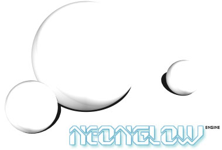

# NeonGlow 3D Engine

NeonGlow is a software rendering 3D engine written in C/C++.

It's a purely educational engine and it was meant to serve as optional lab work for the SPG course (advanced graphics programming) held by Sorin Babii at Technical University of Timisoara. 

As an assistant, I was overseeing the lab work for the course and thought of running this experiment of a 3D engine developed in open-source fashion by students. Students would learn about the internals and architecture of a 3D engine and each year cohort would solidify this knowledge by implementing tasks to enhance it. It ran for a single year, in 2004-2005, with rather mixed results and interest from the students.

The engine aims to be Quake 2 compatible in terms of handling assets, but it differs massively from an architectural point of view.

It's in very early development stage, there are lots of issues and it's badly documented. It's released here for archival purposes and there are no plans to further develop it.

This is a [mirror of the project released on SourceForge](https://sourceforge.net/projects/neonglow/) in 2003.

## Requirements

A C++ compiler
* the engine has been tested using [mingw64](https://www.mingw-w64.org/);
* tested using x86_64-w64 architecture.

SDL 2
* tested with [SDL2-2.30.11](https://github.com/libsdl-org/SDL/releases/tag/release-2.30.11);
* unpack into [lib](lib/) folder or, if you have it installed, adjust the paths to your installation.

Examples come with [Code::Blocks](https://www.codeblocks.org/) projects (optional)

## Building the examples

### Code::Blocks

If you have installed SDL in another directory than [lib](lib/), you may need to 
* adjust Project Build Settings > Search Directories for the SDL include folder
* open the .cbp file and adjust the path in ExtraCommands > XCopy

In order to run an example from Code::Blocks, adjust the Project Properties > Build Targets > Execution Working Dir to point to [examples/data](examples/data) folder (Code::Blocks doesn't seem to like a relative path there).

## License

Code license:
https://opensource.org/licenses/MIT

Some assets come from Quake 2 (textures, palletes, one level and one model).
